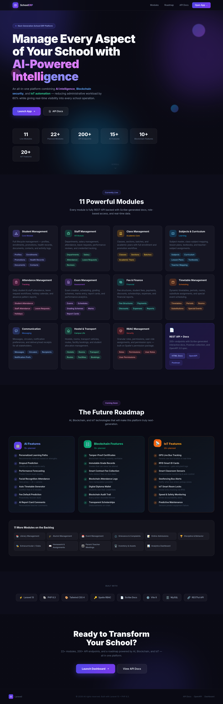
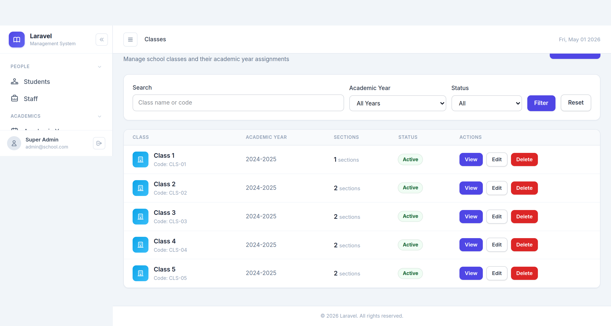
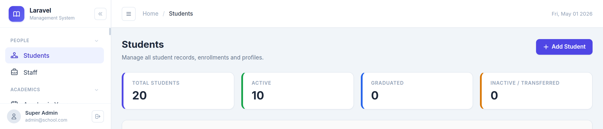

# School Management App

A comprehensive school management system built with **Laravel 13**, covering students, staff, classes, subjects, exams, fees, timetables, attendance, communication, hostels, transport, and RBAC.





---

## Free Features (Included)

### 1. Student Management
- Student profile management (name, DOB, gender, blood group, nationality, religion, addresses, phone, email, profile photo)
- Admission management with unique admission number
- Student status tracking (Active, Inactive, Graduated, Transferred)
- Parent/Guardian records (father, mother, guardian details)
- Previous education records tracking
- Health information storage (height, weight, allergies, medical conditions)
- Student enrollment in specific batches
- Promotion history tracking
- **CSV Import/Export** support

### 2. Staff & Teacher Management
- Staff profile management with personal details
- Employment details (designation, employment type)
- Department management
- Qualification tracking (degrees, specialization)
- Teacher class/subject assignments
- Daily attendance tracking (Present, Absent, On Leave, Late)
- Salary structure management (basic salary, allowances, deductions)
- Performance reviews and ratings
- **CSV Import/Export** support

### 3. Class & Section Management
- Class records management (Grade 1, Grade 10, etc.)
- Section management with capacity tracking
- Batch management (academic year + class + section)
- Student enrollment linking
- Promotion history tracking
- Academic year management

### 4. Subjects & Curriculum Management
- Subject records with codes
- Class-subject association (mandatory/optional)
- Curriculum management per academic year
- Lesson planning with topics and learning objectives
- Textbook management
- Teacher-subject mapping

### 5. Attendance Management
- Daily student attendance (Present, Absent, Leave)
- Teacher/staff attendance tracking
- Student leave requests with approval workflow
- Teacher leave requests
- Holiday calendar management
- **CSV Import/Export** support

### 6. Examination & Grade Management
- Exam records (Midterm, Final, Unit Tests)
- Exam scheduling per class and subject
- Grading scheme definition
- Subject-wise marks entry
- Auto-grade calculation
- Report card generation with class rank
- **CSV Import/Export** support

### 7. Fee & Finance Management
- Fee category management
- Class-based fee structure
- Student fee assignment with discounts/penalties
- Payment tracking (Cash, Card, UPI, Bank Transfer)
- Discount management
- Expense tracking
- Financial reports
- **CSV Import/Export** support

### 8. Timetable & Scheduling
- Room management (Classroom, Lab, Auditorium)
- Day and period management
- Timetable generation per class-section
- Teacher, subject, and room assignment
- Substitute teacher management
- Special events scheduling

### 9. Communication & Notifications
- User management (Student, Parent, Teacher, Staff, Admin)
- Message creation and bulk messaging
- Multi-channel support (SMS, Email, App Notification)
- Circulars and announcements
- Delivery status tracking
- User notification preferences

### 10. Role-Based Access Control (RBAC)
- Role management (Admin, Teacher, Student, Parent, Accountant, Librarian)
- Permission management per module
- Role-permission mapping
- User role assignment
- Dynamic role management

### 11. Hostel, Transport & Facility Management
- Hostel information and room management
- Student hostel assignment
- Transport service management
- Student-transport linking with pickup/drop locations
- Facility booking (Gym, Library, Labs)

---

## Paid Customizations (Available)

### 1. Library Management
- Book catalog with categories and authors
- Member registration (students + staff)
- Book issue and return workflow
- Fine calculation for overdue books
- Book reservations queue
- Reports: most-issued books, overdue list, fine collection

### 2. Alumni Management
- Alumni profile auto-creation on graduation
- Current employment and higher education tracking
- Alumni directory with search
- Alumni events (reunions, webinars)
- Donation/contribution tracking
- Mentorship pairing (alumni ↔ current students)

### 3. Event Management
- Event creation with category, date, venue, budget
- Participant registration (students, staff, parents, guests)
- RSVP and attendance tracking
- Event reminders via SMS/Email
- Post-event feedback and gallery
- Calendar view of all events

### 4. Grievance & Complaint Management
- Complaint submission by students, parents, staff
- Category-based routing with SLA
- Status tracking (open → in-progress → resolved → closed)
- Escalation system
- Comment thread with internal notes
- Anonymous complaint option

### 5. Online Admission & Enrollment
- Public-facing admission portal (no login required)
- Configurable admission cycles
- Multi-step application form
- Document upload (birth certificate, marksheet, photo)
- Admin review and shortlisting workflow
- Entrance test scheduling and results
- Offer letter generation
- Auto-create student record on admission

### 6. Behavior & Discipline Management
- Incident logging (positive and negative behavior)
- Behavior point system
- Warning, suspension, and expulsion workflows
- Parent notification on actions
- Behavior reports per student (term/year)
- Class-level behavior summary

### 7. Extracurricular & Clubs Management
- Club creation and management
- Student club memberships
- Club activities and events
- Club advisor assignments
- Activity participation tracking

### 8. Homework & Assignment Management
- Homework creation per subject/class
- Submission tracking
- Grading and feedback
- Parent notification
- Due date reminders

### 9. Parent-Teacher Meeting (PTM) Management
- PTM scheduling
- Meeting slot booking
- Appointment confirmation
- Meeting notes recording
- Follow-up task assignment

### 10. Inventory & Asset Management
- Asset cataloging
- Asset assignment to staff/rooms
- Maintenance tracking
- Depreciation calculation
- Asset disposal records

### 11. Bus Route & GPS Enhancement
- Route planning and optimization
- Real-time GPS tracking integration
- Parent mobile app tracking
- Stop management
- Driver assignment

### 12. Medical & Health Enhancement
- Medical camp scheduling
- Student medical history
- Vaccination records
- Health reports generation
- Doctor appointment scheduling

### 13. Reports & Analytics Dashboard
- Custom report builder
- Analytics dashboards
- Data visualization
- Export to PDF/Excel
- Scheduled report emails

### 14. Audit Log
- User action tracking
- Complete audit trail
- Compliance reporting
- Security monitoring

### 15. AI Features
- Intelligent analytics
- Predictive insights
- Automated workflows
- Smart recommendations

### 16. OCR & Data Import
- Document scanning
- Auto-data extraction
- Bulk data processing
- Form recognition

---

## Requirements

| Requirement | Version |
|-------------|---------|
| PHP | >= 8.3 |
| Composer | >= 2.x |
| Node.js | >= 18.x |
| MySQL / PostgreSQL | any recent |

**Required PHP extensions:** `ctype`, `curl`, `dom`, `fileinfo`, `filter`, `gd`, `hash`, `intl`, `json`, `mbstring`, `openssl`, `pcre`, `pdo`, `pdo_mysql` / `pdo_pgsql`, `session`, `tokenizer`, `xml`

---

## Installation

### Option A — Web Installer (Recommended)

1. **Clone the repository**

   ```bash
   git clone <repository-url> school-management-app
   cd school-management-app
   ```

2. **Install PHP dependencies**

   ```bash
   composer install --no-dev --optimize-autoloader
   ```

3. **Install & build frontend assets**

   ```bash
   npm install
   npm run build
   ```

4. **Copy the environment file**

   ```bash
   cp .env.example .env
   ```

5. **Set folder permissions**

   ```bash
   chmod -R 775 storage bootstrap/cache
   ```

6. **Start a local server** (if not using Apache/Nginx)

   ```bash
   php artisan serve
   ```

7. **Open the installer in your browser**

   Navigate to: `http://localhost:8000/install`

   The wizard will guide you through:
   - Server requirements check
   - Database configuration (writes `.env` and runs `migrate:fresh`)
   - Default data seeding
   - Administrator account creation

   After completion the app redirects to `/login`.

---

### Option B — Artisan CLI Installer

For headless or automated deployments use the bundled artisan command:

```bash
# Full interactive install (configures .env, migrates, seeds, creates admin)
php artisan school:install

# Skip .env setup (if .env is already configured)
php artisan school:install --skip-env-check

# Skip admin user creation
php artisan school:install --skip-admin-creation
```

The command will interactively ask for:
- Database connection (MySQL / PostgreSQL), host, port, name, username, password
- Application URL
- Administrator name, email, and password

---

### Option C — Manual Installation

If you prefer full control over each step:

```bash
# 1. Clone & install dependencies
git clone <repository-url> school-management-app
cd school-management-app
composer install
npm install && npm run build

# 2. Configure environment
cp .env.example .env
# Edit .env and fill in DB_HOST, DB_DATABASE, DB_USERNAME, DB_PASSWORD, APP_URL

# 3. Generate app key
php artisan key:generate

# 4. Run database migrations
php artisan migrate

# 5. Seed default data
php artisan db:seed

# 6. Create storage symlink
php artisan storage:link

# 7. Clear caches
php artisan optimize:clear

# 8. Create the first admin user (interactive)
php artisan school:install --skip-env-check
```

---

## Post-Installation

| Action | Command |
|--------|---------|
| Start development server | `php artisan serve` |
| Compile assets (dev) | `npm run dev` |
| Compile assets (production) | `npm run build` |
| Clear all caches | `php artisan optimize:clear` |
| Run tests | `php artisan test` |

**Default login:** `http://localhost:8000/login`

---

## Module Overview

| Module | Description |
|--------|-------------|
| Student Management | Enroll, manage, and track students |
| Staff Management | Teachers and non-teaching staff |
| Class & Section | Academic classes, sections, batches |
| Subject Management | Curriculum and subject assignment |
| Attendance | Student and teacher attendance with leave requests |
| Exam Management | Exams, schedules, marks, and results |
| Fee Management | Fee structures, collection, and reports |
| Timetable | Class timetable builder |
| Communication | Circulars, messages, notifications |
| RBAC | Role-based access control (Spatie Permissions) |
| Hostel & Transport | Hostel rooms and transport routes |
| Installer | Web wizard + CLI installer |

---

## Free Features (Included)

### 1. Student Management
- Student profile management (name, DOB, gender, blood group, nationality, religion, addresses, phone, email, profile photo)
- Admission management with unique admission number
- Student status tracking (Active, Inactive, Graduated, Transferred)
- Parent/Guardian records (father, mother, guardian details)
- Previous education records tracking
- Health information storage (height, weight, allergies, medical conditions)
- Student enrollment in specific batches
- Promotion history tracking
- **CSV Import/Export** support

### 2. Staff & Teacher Management
- Staff profile management with personal details
- Employment details (designation, employment type)
- Department management
- Qualification tracking (degrees, specialization)
- Teacher class/subject assignments
- Daily attendance tracking (Present, Absent, On Leave, Late)
- Salary structure management (basic salary, allowances, deductions)
- Performance reviews and ratings
- **CSV Import/Export** support

### 3. Class & Section Management
- Class records management (Grade 1, Grade 10, etc.)
- Section management with capacity tracking
- Batch management (academic year + class + section)
- Student enrollment linking
- Promotion history tracking
- Academic year management

### 4. Subjects & Curriculum Management
- Subject records with codes
- Class-subject association (mandatory/optional)
- Curriculum management per academic year
- Lesson planning with topics and learning objectives
- Textbook management
- Teacher-subject mapping

### 5. Attendance Management
- Daily student attendance (Present, Absent, Leave)
- Teacher/staff attendance tracking
- Student leave requests with approval workflow
- Teacher leave requests
- Holiday calendar management
- **CSV Import/Export** support

### 6. Examination & Grade Management
- Exam records (Midterm, Final, Unit Tests)
- Exam scheduling per class and subject
- Grading scheme definition
- Subject-wise marks entry
- Auto-grade calculation
- Report card generation with class rank
- **CSV Import/Export** support

### 7. Fee & Finance Management
- Fee category management
- Class-based fee structure
- Student fee assignment with discounts/penalties
- Payment tracking (Cash, Card, UPI, Bank Transfer)
- Discount management
- Expense tracking
- Financial reports
- **CSV Import/Export** support

### 8. Timetable & Scheduling
- Room management (Classroom, Lab, Auditorium)
- Day and period management
- Timetable generation per class-section
- Teacher, subject, and room assignment
- Substitute teacher management
- Special events scheduling

### 9. Communication & Notifications
- User management (Student, Parent, Teacher, Staff, Admin)
- Message creation and bulk messaging
- Multi-channel support (SMS, Email, App Notification)
- Circulars and announcements
- Delivery status tracking
- User notification preferences

### 10. Role-Based Access Control (RBAC)
- Role management (Admin, Teacher, Student, Parent, Accountant, Librarian)
- Permission management per module
- Role-permission mapping
- User role assignment
- Dynamic role management

### 11. Hostel, Transport & Facility Management
- Hostel information and room management
- Student hostel assignment
- Transport service management
- Student-transport linking with pickup/drop locations
- Facility booking (Gym, Library, Labs)

---

## Paid Customizations (Available)

### 1. Library Management
- Book catalog with categories and authors
- Member registration (students + staff)
- Book issue and return workflow
- Fine calculation for overdue books
- Book reservations queue
- Reports: most-issued books, overdue list, fine collection

### 2. Alumni Management
- Alumni profile auto-creation on graduation
- Current employment and higher education tracking
- Alumni directory with search
- Alumni events (reunions, webinars)
- Donation/contribution tracking
- Mentorship pairing (alumni ↔ current students)

### 3. Event Management
- Event creation with category, date, venue, budget
- Participant registration (students, staff, parents, guests)
- RSVP and attendance tracking
- Event reminders via SMS/Email
- Post-event feedback and gallery
- Calendar view of all events

### 4. Grievance & Complaint Management
- Complaint submission by students, parents, staff
- Category-based routing with SLA
- Status tracking (open → in-progress → resolved → closed)
- Escalation system
- Comment thread with internal notes
- Anonymous complaint option

### 5. Online Admission & Enrollment
- Public-facing admission portal (no login required)
- Configurable admission cycles
- Multi-step application form
- Document upload (birth certificate, marksheet, photo)
- Admin review and shortlisting workflow
- Entrance test scheduling and results
- Offer letter generation
- Auto-create student record on admission

### 6. Behavior & Discipline Management
- Incident logging (positive and negative behavior)
- Behavior point system
- Warning, suspension, and expulsion workflows
- Parent notification on actions
- Behavior reports per student (term/year)
- Class-level behavior summary

### 7. Extracurricular & Clubs Management
- Club creation and management
- Student club memberships
- Club activities and events
- Club advisor assignments
- Activity participation tracking

### 8. Homework & Assignment Management
- Homework creation per subject/class
- Submission tracking
- Grading and feedback
- Parent notification
- Due date reminders

### 9. Parent-Teacher Meeting (PTM) Management
- PTM scheduling
- Meeting slot booking
- Appointment confirmation
- Meeting notes recording
- Follow-up task assignment

### 10. Inventory & Asset Management
- Asset cataloging
- Asset assignment to staff/rooms
- Maintenance tracking
- Depreciation calculation
- Asset disposal records

### 11. Bus Route & GPS Enhancement
- Route planning and optimization
- Real-time GPS tracking integration
- Parent mobile app tracking
- Stop management
- Driver assignment

### 12. Medical & Health Enhancement
- Medical camp scheduling
- Student medical history
- Vaccination records
- Health reports generation
- Doctor appointment scheduling

### 13. Reports & Analytics Dashboard
- Custom report builder
- Analytics dashboards
- Data visualization
- Export to PDF/Excel
- Scheduled report emails

### 14. Audit Log
- User action tracking
- Complete audit trail
- Compliance reporting
- Security monitoring

### 15. AI Features
- Intelligent analytics
- Predictive insights
- Automated workflows
- Smart recommendations

### 16. OCR & Data Import
- Document scanning
- Auto-data extraction
- Bulk data processing
- Form recognition

---

## Security

If you discover a security vulnerability, please open an issue or contact the maintainer directly. Do **not** publicly disclose it until it has been addressed.

---

## License

This project is open-sourced software licensed under the [MIT license](https://opensource.org/licenses/MIT).
